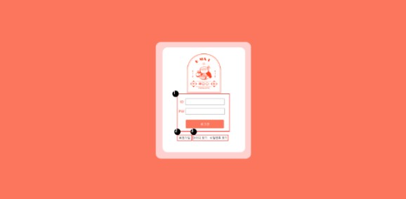
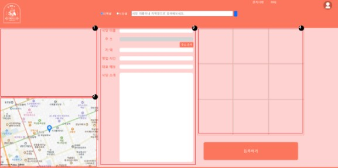
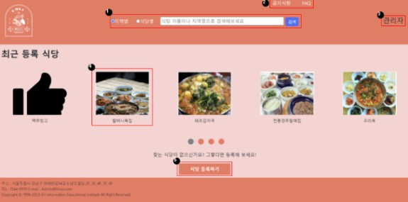

# 우마이(우리들 마음 속 이런 맛집)
> 서로의 맛집을 공유할 수 있는 맛집 플랫폼

## 프로젝트 개요

- ⏱개발 기간: 2023-10-23 ~ 2023-11-17

## 기술 스택
`Front-End` 

`Back-end`

`IDE`

`Communication`

## 사용 라이브러리및 API
- 다음 카카오 주소, 지도 API

## 주요 기능

### 🍜 마음 속에 있던 맛집을 다른 사람들과 공유할 수 있어요.  
  
  
  

+ 맛집 등록
  + 소개하고 싶은 맛집을 등록
  + 정확한 위치를 주소로 입력해 공유

+ 맛집 확인
  + 맛집에 대한 평가를 댓글 형식으로 등록
  + 무엇을 작성할 지 고민하지 않게 항목 별로 점수를 책정할 수 있는 기능

## 팀원 소개

## 👨‍👨‍👦‍👦팀원 구성
* 고이환
  * 이슈 관리 및 마이 페이지 화면 구현, 회원 가입 화면 구현, 마이페이지 기능 구현, 회원가입 기능 구현
* 김동인
  * 형상 관리 및 메인 페이지 화면 구현, 검색 결과 페이지 화면 구현, 메인 페이지 기능 구현, 식당 기능 구현
* 이지혜
  * DB 관리 및 공지사항&FAQ 화면 구현
* 전재현
  * 조장, 일정 관리 및 로그인 화면 구현, 식당 등록 화면 구현 , 리뷰 화면 구현, 식당 등록 기능 구현, 공지사항&FAQ 기능 구현
